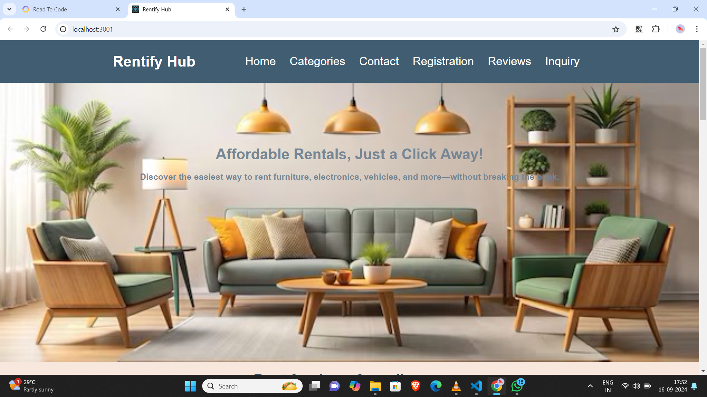

# ***Rentify Hub***
### Website link: https://rentifyhub.netlify.app/

## ***Welcome to Rentify Hub!***
#### Discover the ultimate rental experience with Rentify Hub! This vibrant and user-friendly platform is designed to offer a wide range of rental items including furniture, garments, electronics, and vehicles. Whether you’re looking to furnish your home, update your wardrobe, or find the latest tech gadgets, Rentify Hub makes renting easy and enjoyable 🌟.

## Why Rentify Hub?
Rentify Hub was created to provide a seamless and convenient rental experience for users who prefer renting over purchasing. Whether it's a temporary need for furniture, electronics, or even vehicles, Rentify Hub simplifies the process by offering a diverse range of products for short-term use. The platform promotes sustainability and affordability through renting.

## Key Highlights
- Affordable Rentals: Competitive pricing on a wide range of items.
- Sustainability Focus: Encourages a reuse economy, promoting eco-friendly consumption.
- Convenience: Items are delivered and picked up at your location with flexible rental periods.
- Real-Time Inventory: Instantly see what's available based on your location.
- User Accounts: Create accounts to track rental history, payments, and manage upcoming returns.

## How It Works
- Browse: Search or browse through our extensive catalog of rental items.
- Select: Choose the item you need, review the details, and check availability.
- Book: Book the item by selecting your rental period and making a secure payment.
- Receive: Items are delivered to your doorstep on the scheduled date.
- Return: Once your rental period ends, schedule a return, and we’ll pick up the item!

## Features

- Browse a wide range of rental items including furniture, garments, electronics, and vehicles.
- View detailed information about each item including images, descriptions, and rental prices.
- Easy navigation through various categories of rental items.
- User-friendly interface with responsive design for optimal viewing on all devices.

## Technologies Used
- Frontend: React.js, HTML, CSS
- Deployment: Netlify
- Version Control: GitHub

## Usage
- Open your browser and go to http://localhost:3000 to view the application locally.
- Explore the different categories and items available for rent.

## FAQ
Q: What types of items can I rent?
A: You can rent a variety of items, including furniture, garments, electronics, and vehicles.

Q: How long can I rent an item for?
A: The rental period is flexible, from a few days to several months depending on the item.

Q: What is the return policy?
A: You can schedule a return at any time. If you need to extend your rental, contact our support team before the return date.

## Support

**If you find our projects helpful or interesting, consider giving them a ⭐ it means our lot of us!!!**
